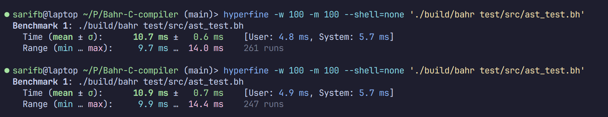

# Bahr-C-compiler

A compiler built in C for a C-like language. I will be making some changes to the syntax and it will resemble something more like rust later. At core it will still be as simple as C though. It's still work-in-progress so I only have some pointer types and integers work yet. The compiler is based on LLVM and uses it as the backend. I plan on trying to bootstrap this language later.

## Project modules and roadmap

The project consists of a main, parser, codegen, hashmap, and an arena:

- File reading system still needs a lot of work and I need to develop a more robust directory reader. I plan on making a configurations system aswell. This would need to be seperated into it's own module.
- Lexer is in a somewhat good state and doesn't need extreme improvements. As it is an intrinsic part of the parser I've moved it there.
- Parser needs a lot of work but can handle function definition, declaration and calling also string literals and integers.
- Codegen also needs a lot of work but can output a "hello world" example.
- Arena is an arena allocator that I borrowed from Tsoding's [arena](https://github.com/tsoding/arena). I've made extensive configurations to it.
- Hashmap uses a C translated version of FxHash's hashing algorithm, used in Rust's compiler. I've also made my own hashmap implementation by storing type-erased values in it.

The project lacks processing and creating of types like structs, enums and unions and arrays.

## Build system

The compiler is built with cmake but I configure the project with cmkr's cmake.toml file. Any changes to project configuration are done through it. I personally build all modules with clang and recently added the pedantic flag to build configuration. I also regularly run the project with valgrind and sanitizers to ensure no memory leaks or undefined behaviour occur.

The project can simply be configured, built and ran with:

```sh
cmake -B build -G Ninja
cmake --build build
./build/bin test/src/test.bh
```

Building the test requires the fish shell, gcc and clang. Fish and gcc can be replaced with any shell or compiler of your choosing. The test project can be ran with:

```sh
./test_run.sh
```

If you want to see the "hello world" example you can call

```sh
./test_main.sh
```

There are many optimizations I will try to still implement (eg. compiling IR to asm or obj in memory). Right now in release mode, "hello world" example completes in about 59 ms on my laptop. Most of the time is spent in codegen, so main culprit is unfortunately LLVM.

24.01.15


## Inspiration

Heavy inspiration was taken from rui314's [chibicc](https://github.com/rui314/chibicc) and from trinnguyen's [llvm-kaleidoscope-c](https://github.com/trinnguyen/llvm-kaleidoscope-c).
